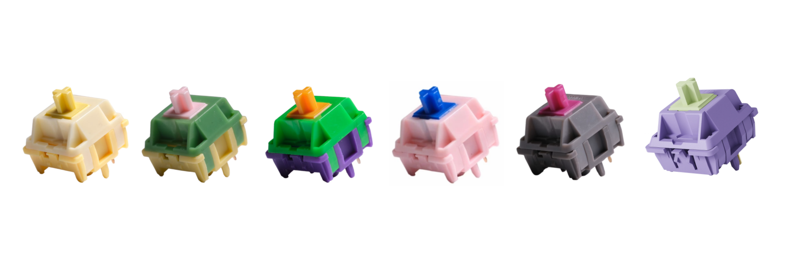

# 🛍️ HMX WORLD

## ⌨️ HMX 스위치 판매 쇼핑몰 (결제 X)

### 2024.04.05 ~ 2024.04.20

## 🥞 Stack

    
    
    

    

    
    

## ℹ️ 기능 소개

📌 Firebase의 Authentication으로 Google OAuth를 이용해서 로그인

📌 Admin 권한이 있는 유저는 상품 등록 O

- Cloudinary와 Firebase를 사용하여 상품과 상품 이미지 저장

📌 로그인 유저는 장바구니에 상품 추가 O

- useCart, useProducts 같은 커스텀 훅을 사용

📌 UI와 비즈니스 로직을 담은 컴포넌트 간의 모듈화

📌 로그인하지 않은 사용자의 장바구니, 상품 등록 페이지 URL 접근을 차단

📌 Context API를 사용하여 유저 정보 관리

- 전역 상태 관리 및 조회 (user, login, logout)
